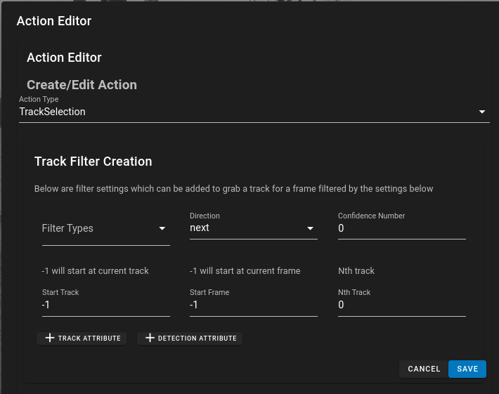

# Actions

Actions are events that can be triggered either as Launch Actions or as specific Keyboard shortcuts to cause an event to happen.  Currently there are two actions, Selecting Tracks and Going to Frames which utlize a very similar structure.  These infrastructure is setup so that in the future as more actions are needed they can be added using the same sort of styling/information.

# Track Selection / GoToFrame



The user interface for the TrackSelection and the GoToFrame actions are very similar.  They set up a bunch of conditions and the viewer will either select the next/previous track or next/previous frame which meet all of these conditions.

* *Filter Types* - Allows to select amongst specific types of tracks.  I.E. only select from tracks which have the type 'Annotation'
* *Direction* - specified selecting next or previous track if the action is connected to a keyboard shortcut.  It will determine the currently select track and select the next that matches the criteria
* *Confidence Number* - select a track which has a confidence number that is greater than a specific value.
* *Start Track* - If searching of next or previous tracks this is the trackId number to start with.  If the value is '-1' it means use the currently selected track.  In most cases this will start with -1
* *Start Frame* - If selecting a track this will use the next track based on the start frame that meets the criteria.  If left to '-1' it will use the current frame.
* *Nth Track* - If you want to select the second, third, fourth, Nth track instead of the first, this setting allows you to that.


## Attribute Filter


Multiple Attribute filters can be added to selecting tracks or using the GotoFrame.  

Attributes Fitlers have the following settings:

* *Attribute* - The specific Attribute you want to test
* *Operator* - The type of operator you want to use.  Contains the typcial comparator/equality operators (>,<,>=,<=, ==, !=) as well as range for specifying a range and 'in' for seeing if the value is in a string.
* *value* - the value to do the comparison against or the lower/upper limit if the operator is a range.

## Action/Shortcut JSON

Below is a typically json snippet of a configuration metadata for actions (Launch Actions) and shortcuts (Action Shortcuts)

```json
"actions": [
    {
        "action": {
            "typeFilter": [
                "waves"
            ],
            "startTrack": -1,
            "startFrame": -1,
            "Nth": 0,
            "attributes": {},
            "type": "TrackSelection",
            "direction": "next"
        }
    },
    {
        "action": {
            "track": {
                "typeFilter": [
                    "waves"
                ],
                "startTrack": -1,
                "startFrame": -1,
                "Nth": 0,
                "attributes": {
                    "detection": {
                        "Attention": {
                            "op": ">",
                            "val": "0"
                        }
                    }
                },
                "type": "TrackSelection",
                "direction": "next"
            },
            "type": "GoToFrame"
        }
    }
],
"shortcuts": [
    {
        "shortcut": {
            "key": "right",
            "modifiers": [
                "ctrl"
            ]
        },
        "description": "Next Attention Section",
        "actions": [
            {
                "action": {
                    "track": {
                        "typeFilter": [
                            "waves"
                        ],
                        "startTrack": -1,
                        "startFrame": -1,
                        "Nth": 0,
                        "attributes": {
                            "detection": {
                                "Attention": {
                                    "op": ">",
                                    "val": "0"
                                }
                            }
                        },
                        "type": "TrackSelection",
                        "direction": "next"
                    },
                    "type": "GoToFrame"
                }
            }
        ]
    },
    {
        "shortcut": {
            "key": "left",
            "modifiers": [
                "ctrl"
            ]
        },
        "description": "Previous Attention Section",
        "actions": [
            {
                "action": {
                    "track": {
                        "typeFilter": [
                            "waves"
                        ],
                        "startTrack": -1,
                        "startFrame": -1,
                        "Nth": 0,
                        "attributes": {
                            "detection": {
                                "Attention": {
                                    "op": ">",
                                    "val": "0"
                                }
                            }
                        },
                        "type": "TrackSelection",
                        "direction": "previous"
                    },
                    "type": "GoToFrame"
                }
            }
        ]
    }
]
}
```


