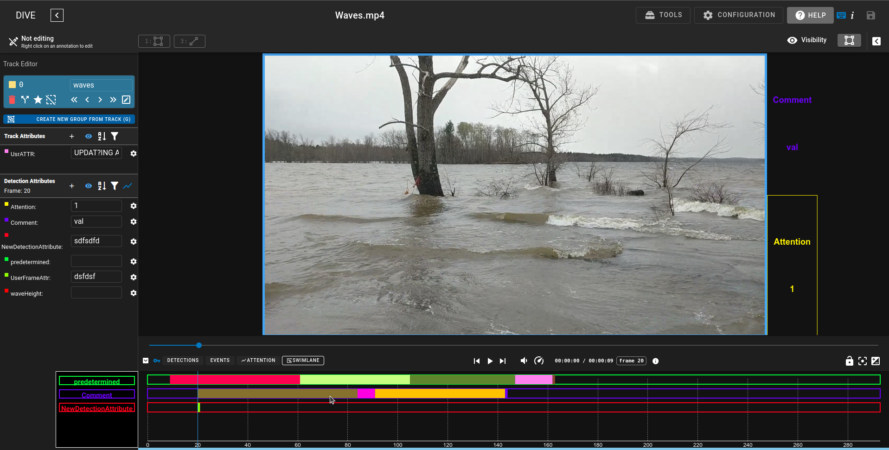
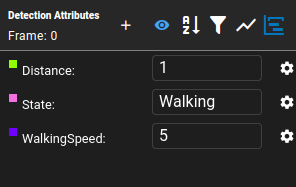
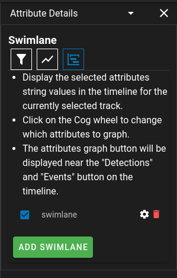
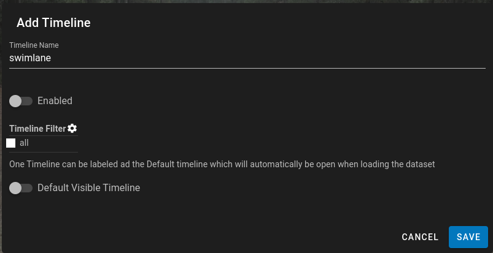
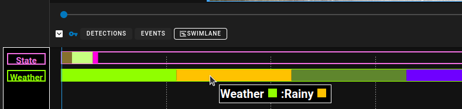

# Attribute Swimlane Graph

Attributes of type string can also be graphed in the timeline where each attribute has a swimlane where the values change over time.

Swimlanes are configured similar to the Numerical Timelines for Detection attributes.  In the Attributes setting there is a swimlane icon ==:material-chart-timeline:== which can be clicked to open the side bar to the swimlane attributes settings.

## Swimlane Timeline Graphs

Multiple swimlanes can be added and enabled from this menu and existing ones can be modified.

Clicking on the settings will bring up the Settings Editor for attributes.

## Display Settings

Display settings control when a swimlane appears and how values are drawn in the timeline.

### Track type visibility

You can limit the timeline display based on track type. Set the display mode to **Selected** and choose which track types should show the swimlane. This lets you use different swimlane graphs for different track types.

Other display options:

* **Display Set Value Indicators** — show diamond markers on frames where values are set.
* **Display Swimlane Tooltip** — show attribute name and value when hovering over the swimlane.

### Render Mode

Each swimlane has a **Render Mode** that controls how value colors are drawn across frames. Use the help icon next to **Render Mode** in the swimlane settings dialog for a quick summary.

* **Classic** — Extends each value's color forward from the keyframe where it was set until the value changes on a later keyframe. This is the default and works well when sparse keyframe data should visually persist across frames.
* **Segments** — Shows explicit start/end regions for each value. Supports **Highlight Segments** and **Edit Segments** so regions can be adjusted directly in the timeline. **Minimum Frame Segment Size** controls behavior when a segment is resized to zero.
* **Discrete** — Shows color only on keyframes where a value is explicitly set. Does not extend color across intermediate frames.

!!! tip

    Use **Discrete** when you only want to see exactly where values were annotated. Use **Classic** when you want to see how a value persists over time. Use **Segments** when you need to view or edit value regions with explicit boundaries.

## Swimlane Settings

Use the key filter to select the attributes you wish to graph and configure the swimlane to be enabled or set as the default graph shown in the timeline area.

If you are creating a swimlane for a numerical attribute, use **[Value Colors](UI-Attributes.md#attribute-value-colors)** to create a color gradient for the values.

For text attributes in swimlanes, color resolution follows the **[Attribute Value Colors](UI-Attributes.md#attribute-value-colors)** settings:

1. The full swimlane row background uses **None Color** when enabled (see [None Color](UI-Attributes.md#none-color)).
1. Missing (`undefined`/`null`) or empty (`''`) value segments also use **None Color** when enabled.
1. If **Static Color** is enabled, non-empty values use the attribute base color.
1. Otherwise, per-value text color mappings are used.

## Swimlane Key

When viewing the swimlane graph a floating 'key' shows up on the left hand side of the graph.  This is used to determine which attribute is being graphed.
Hovering over the attribute name will show the colors associated with the attribute and the value.  Hovering over any color in the swimlane will show the Attribute name and the value as well as the color for that value.
