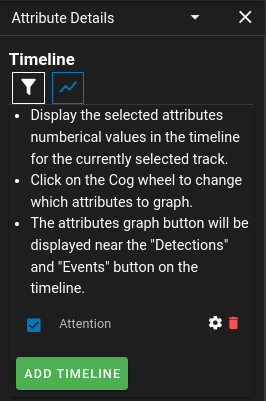
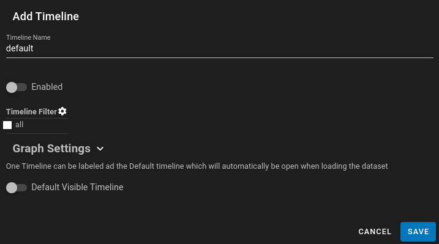
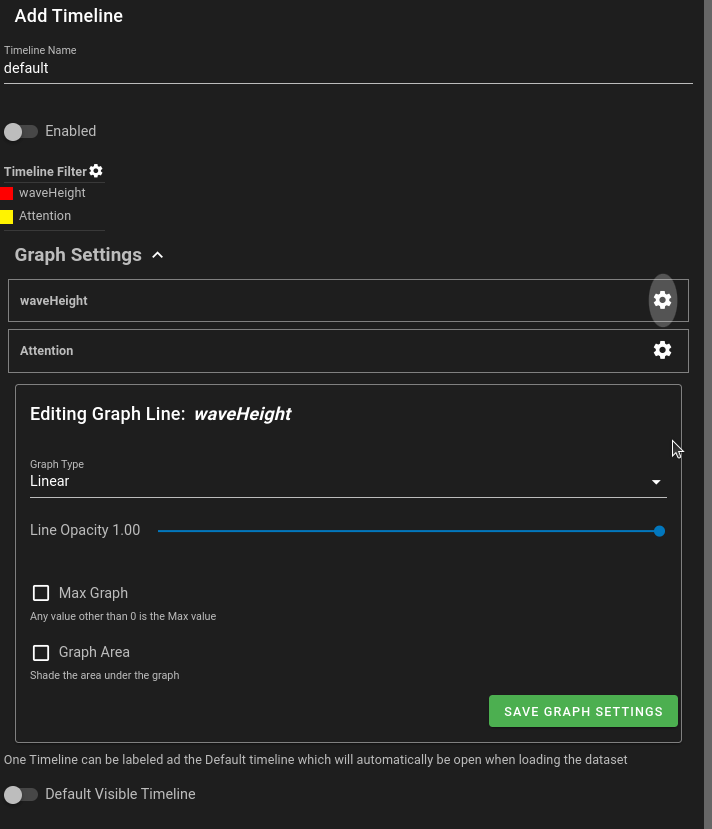
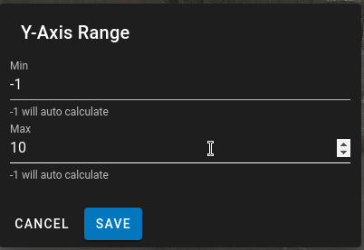

# Timeline Visualization ==:material-chart-line-variant:==

The timeline visualization only applies to numeric and detection attributes currently.  It will graph the selected attributes in a chart at the bottom of the screen when a Track is selected. Currently only the selected Track will have it's attributes graphed.

A Key Filter is used to determine which attributes to graph.

{ align=center width=800px }

To open the Attribute Graphing tool you can either use the context menu for Attribute Details on the right side of the application or the Timeline chart icon ==:material-chart-line-variant:== within the Attribute Panel.

{ align=center width=300px }

This shows a list of the current active timelines (indicated by a checkmark).  From here you can delete timelines, editing them using the cogwheel or add new timelines.
Active timelines show up with their name in the Timeline at the bottom when a track is selected.

{ align=center width=600px }

## Timeline Editor

{ align=center width=600px }

* *Name* - The name that will be displayed in the timeline when viewing the timeline.
* *Enabled* - if this timeline will be enabled so users can access and view it.
* *Timeline Filter* - Similar to the tool used for [Attribute Filtering](UI-AttributeFiltering.md).  This can be used to graph only a subset of detection attributes.
* *Default Visible Timeline* - If this is set to true, when loaded the program will default to showing this in the [Timeline](UI-Timeline.md) instead of the Detection or Attribute Views.
* *Y-Axis Range* - Ability to set a custom Y-Axis range.  If the values are left at -1, -1 it will auto calculate the range based on the values in the graph.

## Graph Settings

{ align=center width=600px }

If you have individual selected attributes to graph, you can set details about these indivdual graphs here.

* *Graph Type* - Change the graph from a simple linear graph to using D3 modes such as step after (it will appear like a step graph) or natural (a more curved graph)
* *Line Opacity* - Sets the opacity of the line that is drawn.  This can be useful if you want to remove the solid color of the line and just use the area under the graph.
* *Max Graph* - All values that are non-zero will automatically scale to the maximum value of the graph.  This is handy if you want to draw attention to areas of a track that are important.
* *Graph Area* - If this is set to true it will shade in the area under the graph based on the color and opacity that is chosen.

### Attention Regions

{ align=center width=600px }

In the image above one of the graphed attributes will go from 1 to 0 at specific frame times.  Using the graph settings it can appear to highlight regions by:
* setting the graph type to 'step after'
* setting the line opacity to 0
* setting it to use the Max Graph setting
* setting it to graph the area under the graph

This is a simple way to get highlighted regions of a track to draw attention to the user.

### Y-Axis Adjustments

Besides setting the Y-Axis Range in the settings for the graph, the Y-Axis range can be adjusted at any time by hovering over the Y-Axis and double clicking.

The Axis will update as you change the values and you can click Save to accept the new Axis range.  NOTE:  This will not change TimelineGraph Settings Y-Axis if they are set so reloading will not persist the new range.  It is meant to adjust the range on the fly for viewing data.