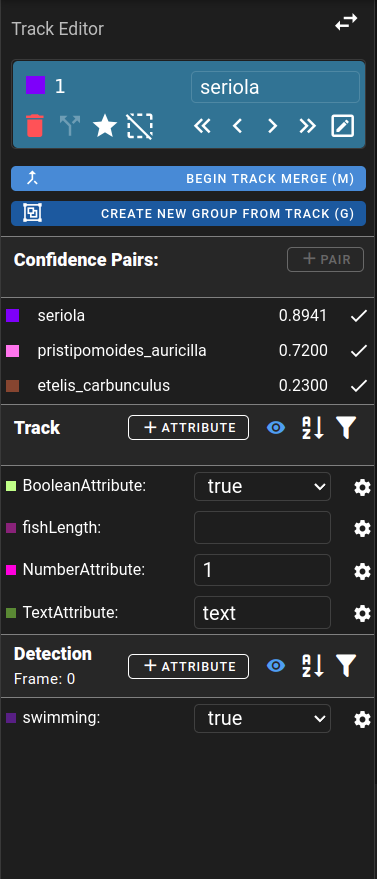
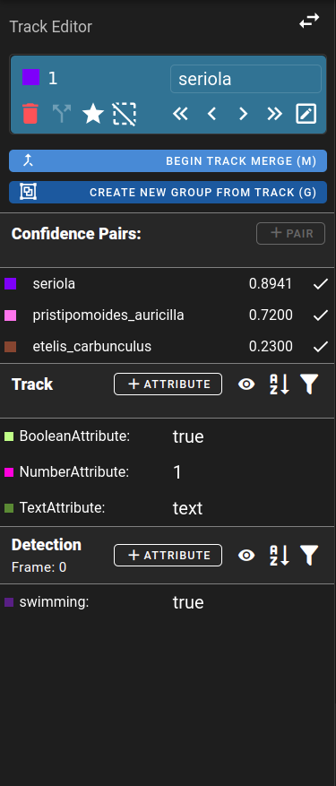
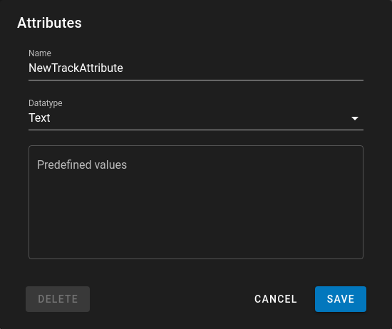
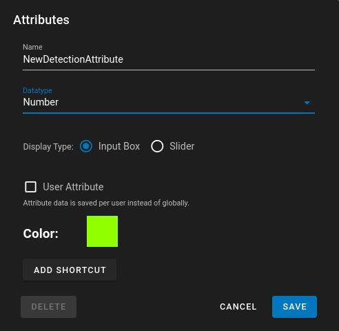
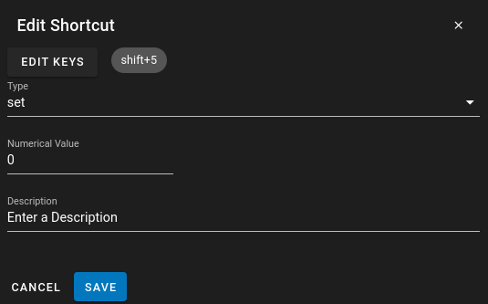
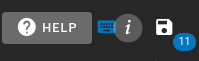
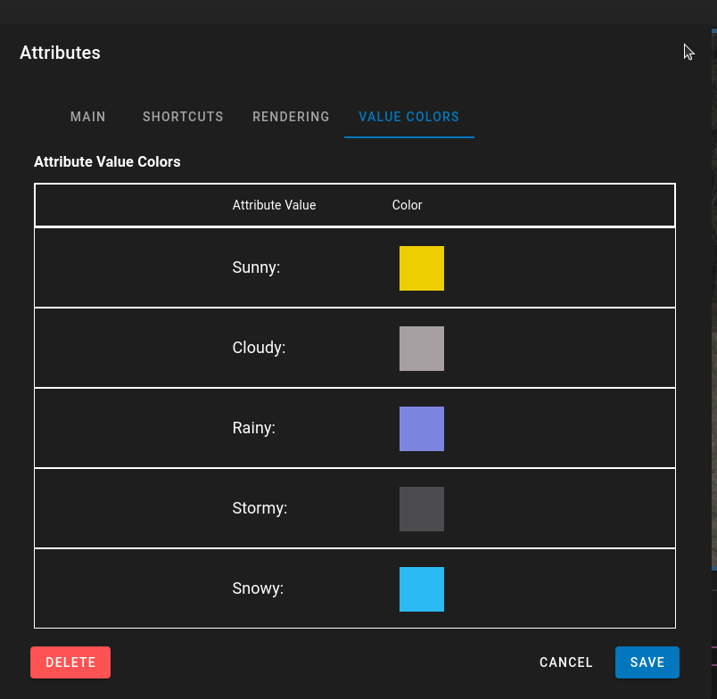
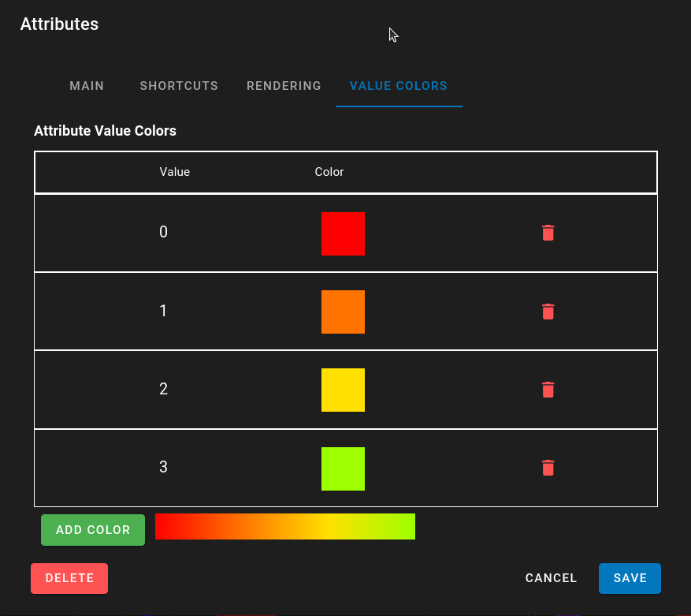
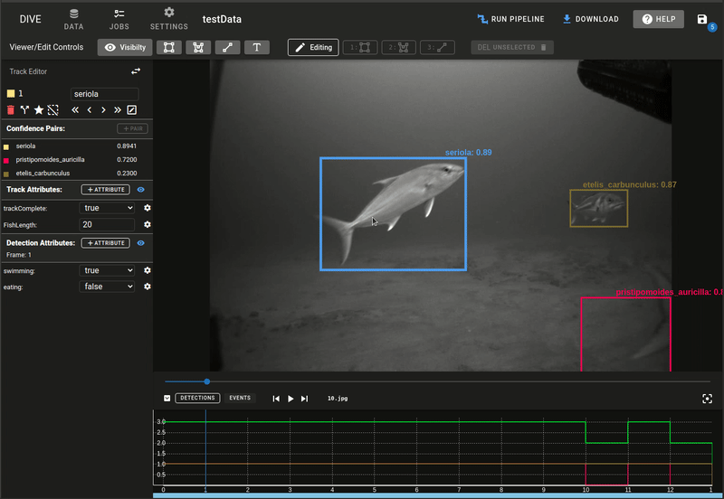

# Attributes

## Concepts and Terms

- **Attribute Definitions** are templates.  They have a name and a value type, such as `String`, `Number`, or `Boolean`.  Definitions must be created before attribute values can be assigned.  Tracks and detections each have their own set of definitions.
- **Track Attributes** apply to an entire track. Each track can only have one value for each track attribute definition.
- **Detection Attributes** can be different for every frame in a track.

### Example Attribute Definition

- Track Attributes:
    - CompleteTrack: `Boolean`
    - FishLength: `number (cm)`
- Detection Attributes:
    - Swimming: `Boolean`
    - Eating: `Boolean`

### Example Attribute Values

- Fish Track 1
    - Track Attributes
        - `{ "FishLength": 20 }`
    - Detection Attributes
        - Frame 1
            - `{ "Eating": True }`
        - Frame 2
            - `{ "Swimming": False, "Eating": True }`

!!! Info

    All Attribute definitions do not need to be assigned to values.  CompleteTrack (Track Attribute) and Swimming for Frame 1 (Detection Attribute) weren't assigned in this example.

## Using the Attributes Panel

{ align=right width=260px }

1. Select an existing track or detection with left click.
1. Open the Track Details page by clicking on the ==:material-swap-horizontal:== button in the [Type List](UI-Type-List.md) area or pressing the ++a++ key.
1. Here you will see the track/detection type, confidence pairs associated with it and then a list of track and detection attributes.
1. For attributes there are two sections
    1. **Track Attributes** - All track level attributes
    1. **Detection Attributes** - attributes associated with the track on a per frame basis
1. Attributes can be sorted by their name (alphabetically) or by their numeric value.  Clicking on the ==:material-sort-alphabetical-ascending:== or the ==:material-sort-numeric-ascending:== button will swap between the two.
1. Attribute Filtering
    1. The Attribute filtering icon ==:material-filter:== will change color when filtering is being applied.
    1. Clicking on the filter icon will bring up the Attribute Details Panel where **[Attributes Filtering](UI-AttributeFiltering.md)** and **[Attributes Timeline Graphing](UI-AttributeTimeline.md)** can be done.

!!! info

    Attributes found during import in a [VIAME CSV](DataFormats.md#viame-csv) will automatically show up in the list.  The data type of the attribute is guessed by examining values and may need to be manually corrected.

By default, all attributes associated with the dataset are visible and editable.  You can hide unused attributes by clicking the ==:material-eye:== toggle next to ==:material-plus: Attribute==.

| Show Unused ==:material-eye:== | Hide Unused ==:material-eye-off:== |
|-------------|-------------|
 | 

## Creating Attribute Definitions

1. Click on the ==:material-plus: Attribute== icon for in either the track or detection attribute area.
    1. 
1. Enter a unique name
1. Choose a Datatype
    1. `Number`
    1. `Boolean` (True/False)
    1. `Text`
        1. Custom text that the user provides
        1. A predefined list of text to choose from, separated by newline.
1. Click ==Save== to add the new attribute

## Editing Attribute Definitions

Click the ==:material-cog:== button next to an existing attribute to edit its definition.

!!! warning

    Editing or deleting an attribute **definition** doesn’t change any existing attribute **values**.

    * **Deleting** an attribute definition will cause it to disappear from the list, but the values will remain in the database.
    * **Editing** an attribute definition will change the way the controls behave, but will not change any existing set values.

* *User Attribute* - This flag will set the attribute so that the storage of data is per user instead of globally.  By defauly attributes are stored on the dataset and are universal for each user that views/edits the dataset.  If this flag is set the attributes will be per user so that different user's when setting attributes will see different values.  This is stored in the TrackJSON structure under 'UserAttributes' key for track and detection attributes.  There is a new Sidebar called User Attribute Review which allows for reviewing of all user attributes.
* *Color* - Allows specification of a custom color to represent the attribute when filtering or when graphing the attribute value

## Metadata Linking

Metadata linking allows a **detection attribute** to automatically write its value into a DIVEMetadata field whenever that attribute is edited.

### How to configure

1. Open the attribute definition editor (==:material-cog:== next to an attribute).
1. Enable metadata updates for the attribute.
1. Choose one of these key modes:
    1. **Fixed key** - Enter a single DIVEMetadata key name to always update.
    1. **Dynamic key from another attribute** - Select a different **text detection attribute** that uses **locked predefined values**.  
       The current value of that source attribute becomes the DIVEMetadata key name.

!!! info

    For dynamic keys, each predefined value should exactly match a DIVEMetadata key.  
    If a key is missing or locked, updates will be skipped until that key is created and unlocked.

### Conditional metadata updates

When conditionals are disabled, every value change writes to DIVEMetadata.

When conditionals are enabled, behavior depends on datatype:

- **Number attributes**
    - `min` - update only when the new value is lower than the current stored metadata value.
    - `max` - update only when the new value is higher than the current stored metadata value.
    - `greater_than` - update only when the new value is greater than the configured threshold.
    - `less_than` - update only when the new value is less than the configured threshold.
- **Text attributes**
    - `contains` - update only when the text value includes a configured substring.
- **Boolean attributes**
    - Always update on change (no conditional rules).

### Requirements and notes

- Metadata linking only writes when the dataset is connected to a DIVEMetadata root.
- The destination key must be editable (unlocked) in DIVEMetadata.
- Invalid values (for example, non-numeric values with numeric conditions) do not trigger writes.

## Attribute Shortcuts

A specific key shortcut can be assigned to setting the value of an attribute.  When the user presses this key combination the Attribute can be set, unset, or prompt the user for a value.

* *Edit Keys* - After clicking this button put in a keyboard combination which you want to use to assign a value to the attribute.  There are reserved shortcuts and the dialog will inform you if you're using a reserved shortcut.
* *Type* 
    * *set* - set the value to a specific defined numerical/text/boolean value
    * *remove* - removes the value from the attribute and resets it back to empty
    * *dialog* - a dialog pops open asking the user for input for the attribute value
* *Description* - a text based description of the shortuct.  This description is used in the Help dialog to show what all the keyboard shortcuts are.

### Button Shortcuts

Each attribute shortcut can also expose a button in the **[Custom UI](#custom-ui)** panel on the right side of the screen.

1. Add or edit a shortcut on the **Shortcuts** tab.
1. Enable **Enable Button Shortcut**.
1. Configure button text, tooltip, prepend/append icons, and button color.

When a button shortcut is enabled, clicking the button in the Custom UI panel performs the same action as the keyboard shortcut.

In the upper right of the screen the keyboard icon is used to toggle on/off system and attribute shortcuts.
The info icon next to it will display a list of possible shortcuts that are set and will use the Description to explain what a shortcut does.

## Custom UI

The **Custom UI** panel is a context sidebar that shows attribute button shortcuts and, optionally, the current attribute value for the selected track. It is useful for workflows where annotators set attributes frequently without opening the Track Details panel.

### Enabling the Custom UI Panel

The panel itself is configured at the dataset level:

1. Open **Configuration** → **UI Settings** → **Context Bar**.
1. Enable **Custom UI Enabled**.
1. Optionally set:
    * *Title* - Panel heading (defaults to `Custom Actions`).
    * *Width* - Panel width in pixels.
    * *Information* - Markdown help pages shown in the panel.
    * *Attribute button order* - Drag to reorder attribute groups in the panel.

See [Context Bar](UI-Settings.md#contextbar) for more information on context sidebar settings.

### Configuring an Attribute

Open the attribute definition editor (==:material-cog:==) and select the **Custom UI** tab.

#### Visibility

* *Show in Custom UI* - When disabled, the attribute is hidden from the Custom UI panel even if it has button shortcuts.
* *Show Without Buttons* - Display this attribute in Custom UI even when it has no button shortcuts. Use this to show a read-only value display without assigning shortcut buttons.

#### Display Value

* *Display Value* - Show the current attribute value in the Custom UI panel for the selected track. When enabled, additional display options appear below.

When **Display Value** is on, the value updates as you change the selected track or frame. For detection attributes, the value reflects the attribute on the current frame.

#### Sticky Value

Sticky value is available for **detection attributes only**.

* *Sticky Value* - When the attribute is empty on the current frame, show the last non-empty value from an earlier keyframe on the same track. This is useful for sparse detection attribute data where you want the panel to keep showing the most recent value instead of going blank between keyframes.

When sticky value is enabled, values inherited from a previous keyframe can be styled separately under **Inherited Value Indicator**:

* *Bold*, *Italic*, *Underline*
* *Font Color* - Custom color for inherited values
* *Font Size* - Same size, smaller, or larger than the normal value
* *Opacity* - Fade inherited values to distinguish them from values set on the current frame

Inherited values also show `(inherited from previous keyframe)` in the tooltip when you hover over the value.

!!! info

    **Sticky Value** in Custom UI is separate from the **Sticky** option under the attribute **Rendering** tab. Rendering sticky affects how values are drawn next to tracks in the annotation view; Custom UI sticky affects the value shown in the Custom UI panel.

#### Value Display

These options appear when **Display Value** is enabled.

* *Value Position*
    * *Below buttons* - Value appears under the shortcut buttons (default).
    * *Above buttons* - Value appears above the shortcut buttons.
    * *In header (inline with title)* - Value appears on the same line as the attribute name.
* *Header Separator* - When value position is **In header**, the character placed between the attribute name and value (`:` or `-`).
* *Header Value Offset* - Horizontal space in pixels between the separator and the value in header mode.
* *Long Value Display* - How values longer than 50 characters are handled:
    * *Expand* - Collapse into an expansion panel; click to view the full value.
    * *Truncate* - Show the first 50 characters followed by `...`. Hover for the full value in a tooltip.
    * *Scroll* - Show the value in a scrollable area.
* *Font Size Multiplier* - Scale the displayed value text size (1 is default).
* *Value Alignment* - Left, center, or right alignment for the value text.
* *Value Color* - Optional text color for the displayed value. When **Attribute Value Color** is enabled, the color comes from the **[Value Colors](#attribute-value-colors)** settings for that attribute (including per-value mappings and gradients). When disabled, choose a fixed custom color.
* *Value Prepend Text* / *Value Append Text* - Static text placed before or after the displayed value (for example, units like `cm` or labels like `Status:`).
* *Empty Value Label* - Text shown when the attribute has no value. Leave blank to show nothing.

#### Header

* *Show Header* - Show the attribute name as a heading in the Custom UI panel.
* *Show Description* - Show the attribute description above the buttons in the Custom UI panel.

### Legacy configurations

Older configurations may store `displayValue` on individual button shortcut objects. This setting is deprecated and has moved to the attribute's **Custom UI** tab. Existing datasets are migrated automatically when the configuration is loaded; the per-button `displayValue` field is removed on save.

## Attribute Value Colors

Attributes of type **Text** and **Number** can have custom colors configured in the attribute editor under the **Value Colors** tab. These colors affect how attribute values appear in **[Attribute Rendering](UI-AttributeRendering.md)**, **[Attribute Swimlanes](UI-AttributeSwimlanes.md)**, and the **[Custom UI](#custom-ui)** panel when value color is set to use attribute value colors.

### Text attributes

If your attribute type is **Text**, the Value Colors tab lets you assign a color for each known text value in the dataset.

Color selection for each value follows this order:

1. If the value is missing (`undefined`/`null`) or empty (`''`), use **None Color** when enabled.
1. If the value is empty (`''`) and a color is set for the empty string key in Value Colors, that color can be used when None Color is not set.
1. If **Static Color** is enabled, all non-empty text values use the attribute base color.
1. Otherwise, per-value color mappings from Value Colors are used.

### Number attributes

Numerical attributes can use a color gradient. Configure numerical values and assign each a color; DIVE automatically generates a gradient between them. Swimlanes and Attribute Rendering use these gradients when value color is set to **auto**.

### None Color

**None Color** is an optional background color for missing or empty values (`undefined`, `null`, or `''`).

When enabled, None Color is used in two ways:

1. **Swimlane row background** — fills the full background of that attribute's swimlane row for the length of the track. Value segment colors are drawn on top of this background.
1. **Missing/empty value color** — used when resolving the color for a missing or empty value in swimlanes and attribute rendering.

The swimlane row outline uses the attribute's base **Color** setting. Per-frame value regions use Value Colors, Static Color, or the number gradient as appropriate.

!!! info

    Empty/missing aliases like `NA`, `N/A`, or `__EMPTY__` are not used for automatic empty handling. Use **None Color** and/or the empty string (`''`) value key.

### Static Color

When **Static Color** is enabled, all non-empty values use the attribute's base **Color** instead of individual Value Color mappings. This applies in swimlanes and attribute rendering.

## Setting Attribute Values

1. Click on the attribute value when in viewing mode to edit and set the attribute
1. Or directly edit the value field when in the attribute editing mode
1. Setting an attribute to the empty value will remove the value from the track/detection

## Importing and Exporting Attributes

Attributes are part of the dataset configuration that can be imported and exported.

1. Set up a dataset with all the attributes you need
1. In the ==:material-download: Download== menu, choose ==Configuration==.
1. Use this configuration with other datasets
    1. Use the ==:material-application-import: Import== button to load this configuration to other datasets.
    1. Upload the configuration file when you create new datasets to initialize them with these attribute definitions.

## Applying Attributes Demo

