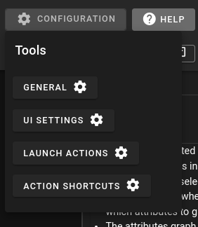
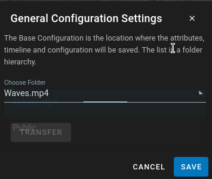
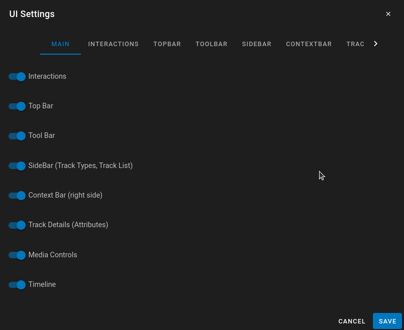
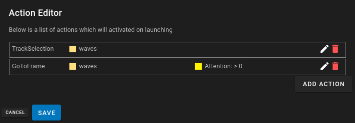
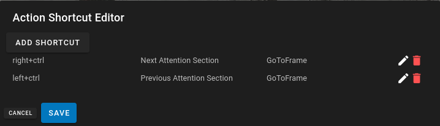

# Configuration

DIVE-DSA has the capability to specify configurations for datasets.  Configurations can customize the user interface and limit the capability of standard users to access features within DIVE.  Things like preventing Editing, Hiding uneeded features can be configured. 

 Additionally launch actions can be configured to select specific tracks or go to specific timeframes based on conditions specified.

 Along with launch actions, special keyboard shortcuts can be configured to perform actions, like selecting tracks or going to specific frames in tracks.

Visual masks are also stored in the dataset configuration.  They are owner/admin-managed rectangular overlays that persist until changed on a later frame.  For usage details, see [Visual Masks](UI-Visual-Masks.md).

## General

The general setting is where you configure the location of the configuration JSON data.  The Configuration can be at any level in the folder hierarchy.  If it is higher in the level all sub folders will use the same configuration.  This is a way that the configuration can be unified amongst all dataset in a folder.

In the dropdown you can choose the folder where the configuration lives.  If you are changing it to a sub folder or a parent folder you can use the 'Transfer' button to move the configuration to the higher level.

### UI Configuration Import / Export

General also provides **Export** and **Import** for a portable **UI Configuration** bundle. This is separate from Download → Configuration on a dataset (see [Web Version](Web-Version.md#download-or-export-data)).

The UI Configuration JSON includes:

* Nested `configuration` (UI Settings, launch actions, action shortcuts, timeline layouts, custom UI, visual masks, general settings)
* Attribute definitions
* Timeline and swimlane graph definitions
* Filters
* Type/group styling and confidence filters

**Export** walks up the folder hierarchy from the open dataset, finds the base configuration folder (where `baseConfiguration` points to itself), and downloads that folder’s full UI Configuration as a `.ui-config.json` file. Server-specific folder ids such as `baseConfiguration` are cleared so the file can move between servers.

**Import** writes to the folder currently selected in the General **Choose Folder** dropdown (the general hierarchy level), not automatically to the open dataset unless that is the selected folder. You need write access on that folder. On import, `baseConfiguration` is rewritten to the destination folder id, and the destination’s UI configuration fields are replaced. Confirm the overwrite prompt before continuing; the viewer reloads after a successful import.

See [Data Formats — UI Configuration JSON](DataFormats.md#ui-configuration-json) for the file shape.

## UI Settings

UI settings enable toggling of differnt UI elements in the UI for all users.
For more details I would go specifically to the [UI-Settings](UI-Settings.md )section to view the elements

## Launch Actions

Launch Actions are actions that are created on launch which automatically trigger certain behaviors.
There are two types of launch actions currently.
For more details I would go specifically to the [UI-Actions](UI-Actions.md )section to view the details.

## Action Shortcuts

Action shortcuts are similar to launch actions except they are triggered by a customizable keyboard shortcut instead of being triggered on launch.  Any Action configured in Launch Actions can be configured to a shortcut.  This also includes the capability to select next/previous for tracks and timeframes that match conditions.
For more details I would go specifically to the [UI-Actions](UI-Actions.md)section to view the details.

## UI Configuration JSON

The User interface configuration is stored in the metadata of the Dataset Folder, or the parent folder which contains the item.

Go to [UI-ConfigurationJSON](UI-ConfigurationJSON.md) for more information
