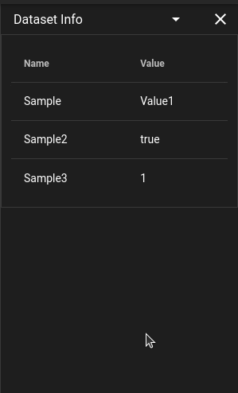

# Dataset Info

Information about the dataset can be displayed within the DIVE-DSA annotation tool be applying metadata to the folder of the dataset.

Utilizing the girder interface to add metadata or using the endpoint 
`PUT /folder/{girder_id}/metadata` 
with the key of `datasetInfo` will allow for meatadat to be added to the folder which will then be displayed in the user interface.

## Attributes Panel in Dataset Info

When a track is selected and the dataset has attribute definitions, an **Attributes** panel appears in Dataset Info.

- **Track Attributes** show values attached to the selected track.
- **Detection Attributes** show frame-specific values for the selected track at the current frame.
- Empty sections are hidden automatically. For example, if there are no detection attributes, the detection section and its settings menu are not shown.

### Stickiness (Detection Attributes)

Detection Attributes include a settings menu (`:material-cog:`) with a **Stickiness** toggle.

- When disabled, only values set on the current frame are shown.
- When enabled, empty current-frame values can reuse the most recent non-empty value from earlier keyframes.
- Inherited values are indicated in the value tooltip text.

### Value Display and Tooltips

- Long values are truncated in-row for readability.
- Hovering a value shows the full text in a tooltip.
- Hovering attribute info (`:material-information:`) shows datatype and predefined values (for text attributes with value lists).

