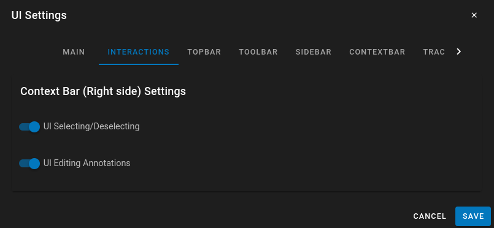
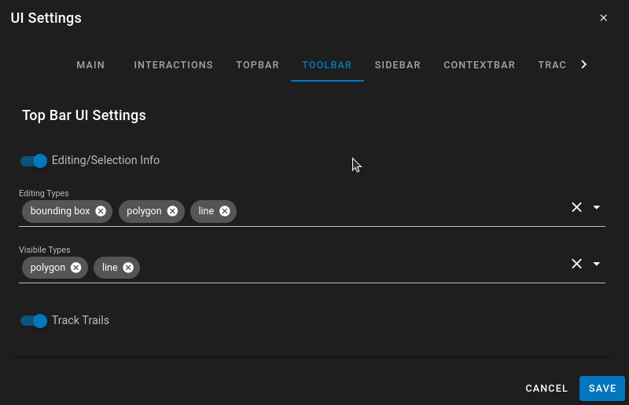
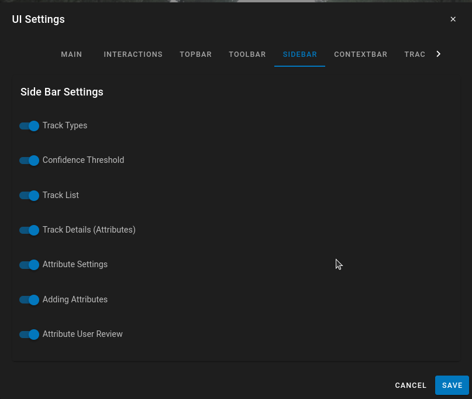
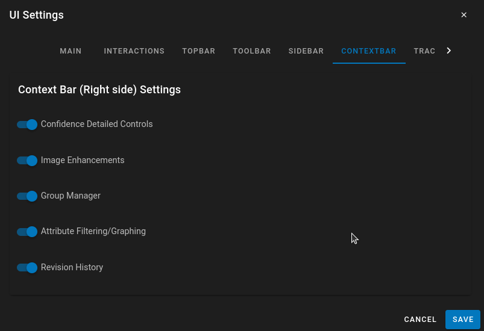

# UI Settings

The main section of the UI-Configuration where different elements of the UI can bet turned on and off

## Main

Under the Main Setting as you disable this main groups the submenus will be removed.  I.E If you remove the 'Track Details' you no longer can customize what is visible in the Track Details Subsection.

* Interactions - Disable User interactions for editing/creating tracks.
* Top Bar - Removes the entire Top Bar (For Owners/Admins the Configuration button will remain)
* Tool Bar - Removes the Tool Bar containing the Editing/Viewing Options
* SideBar - Removes the Side Bar containing the Track List and Track Types.  If you remove this by default the Track Details will be enabled.
* Context Bar - Removes all context bar (Revision History, Attribute Filtering/Graphing, Groups, Threshold Controls )
* Track Details - Removes the Track Details pages (Left side of the screen, the alternate view of the Type List/ Track List)/
* Media Controls - The playback controls for the video/image sequence
* Timeline - The bottom timeline visibility.

## Interactions

* UI Selecting/Deselecting - Disable the user from selecting/deselecting tracks.  This is useful if you are using Launch Actions or Action Shortcuts in the configuration to automatically select tracks.
* UI Editing Annotations - This will prevent the user from being able to enter edit mode and change the annotation.  They still have the capability to set/change Attributes, they just can't change/edit tracks using the standard methods or keyboard shortcuts.

## TopBar

Most of the options are pretty clear.  It turns off and on different buttons in the UI.  NOTE:  If you are the owner of the dataset or an Admin the configuration button will always appear even if turned off.  This is to ensure that you can change the configuration through the UI if you hide the option from standard users.

## ToolBar

The ToolBar is used for editing tracks and changing the visualization of tracks.  The Editing Types and Visible Types are multi-select which allows for customization of the types of annotations that can be edited/created and the visbility of specific types of annotations.  It may not be necessary for the annotator to know about line or polygon types so you can remove them from the menu if not needed.

## SideBar

* Track Types - hide the Track type listing on the left side of the screen
* Confidence Threshold - Disable/Hide the confidence threshold to prevent annotators from changing the value
* Track List - Hide the entire track list
* Track Details - Hide the Track details (The alternative view of the left sidebar)
* Attribute Settings - Hide the Attribute settings to prevent users from adding/modifying attributes
* Adding Attributes - Prevent users from adding additional attributes to the Dataset
* Attribute User Review - When you have User attributes Attribute User review allows for a user to see all of the other user's attributes and review them.

## ContextBar

Hide or enable the additional contextual menus on the right side of the screen.

## Track Details

Customize the interface of the track Details.  The details of Track/Detection Attributes are customized more in SideBar (Specifically enabling adding/editing and customization of Attributes)

## Playback Controls

Customize the interface on the playback controls to hide interfaces not needed.

## Timeline

