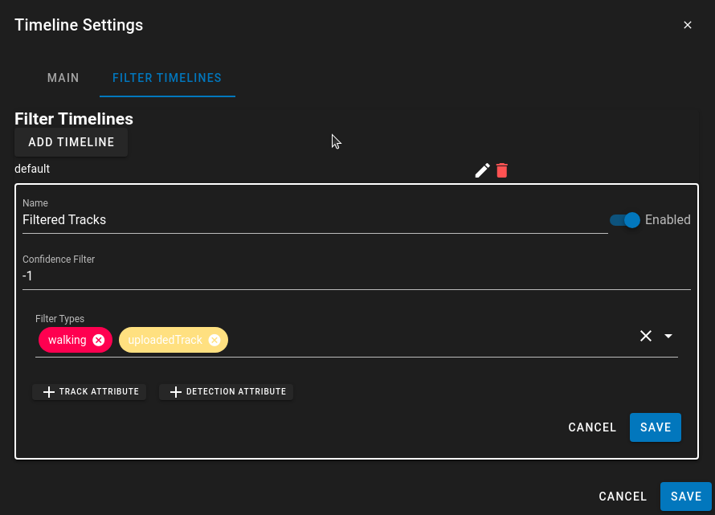

# Timeline Settings

Customizing the timeline as well as adding filtered timelines can be done through the Configuration -> Timeline Settings menu.

The Custom Timeline List is used to layer multiple timelines on top of each other so they can be displayed simulatneously.  This will replace the default list of timelines that are available with a custom style.

## Custom Timeline List

In the dropdown list are available timelines that can be added to the main view.  These include the default Detection/Events timelines, any [Attribute Swimlane Timelines](UI-AttributeSwimlane.md), [Attribute Graphing Timelines](UI-AttributeTimeline.md), or any Filter Timelines.

The Max Timeline Area Height is used to adjust the height of the timline at the bottom of the screen to larger value to accomodate more data.

After Adding a Timeline you can click on the Edit button to modify the details of how the timeline works

### Custom Timeline Editing

The editing for invidual timelines will appear directly in the editing as a new card.

* *Max Height* - Sets the max height for this timeline.  Setting it to -1 will auto size the timeline based on the available space.
* *Order* - Starting with 0 at the top will set the order of the timelines.
* *Dimissable* - allows the user to hide the timeline if not desired.  They can renable it using the menu options afterwards.

The charts are then placed in the timeline area.  Each chart is dismissable so there is an X in the corner which can be clicked to remove the chart.
If a chart is removed it then appears in the menu with an "Enable" button to add the chart back to the timeline area.

Clicking "Enable" will display any charts that have been dismissed.

## Timeline Event Filters

The Filter Timelines allows for the creation of the base Event Timeline but with a specific filter to only tracks that meet specific conditions.
THe Filtering used to display the tracks in the chart are similar to the filters used in the [Actions Editor](UI-Actions.md)

* *Name* - A Name to display in the configuration, or as a title when selecting timelines
* *Enabled* - Enables the timeline so it is visible
* *Confidence Filter* - Sets a filter so only tracks with a confidence value above it are displayed.  -1 is a default to ignore the confidence filter.
* *Filter Types* - Provide a list of types of tracks that should be displayed in this filtered view.
* *Track Attribute* - Set a condition where the tracks needs to have X track attribute value to be displayed in this list.
* *Detection Attribute* - Sets a filter so only tracks which have a specific detection attribute are displayed in the list.

